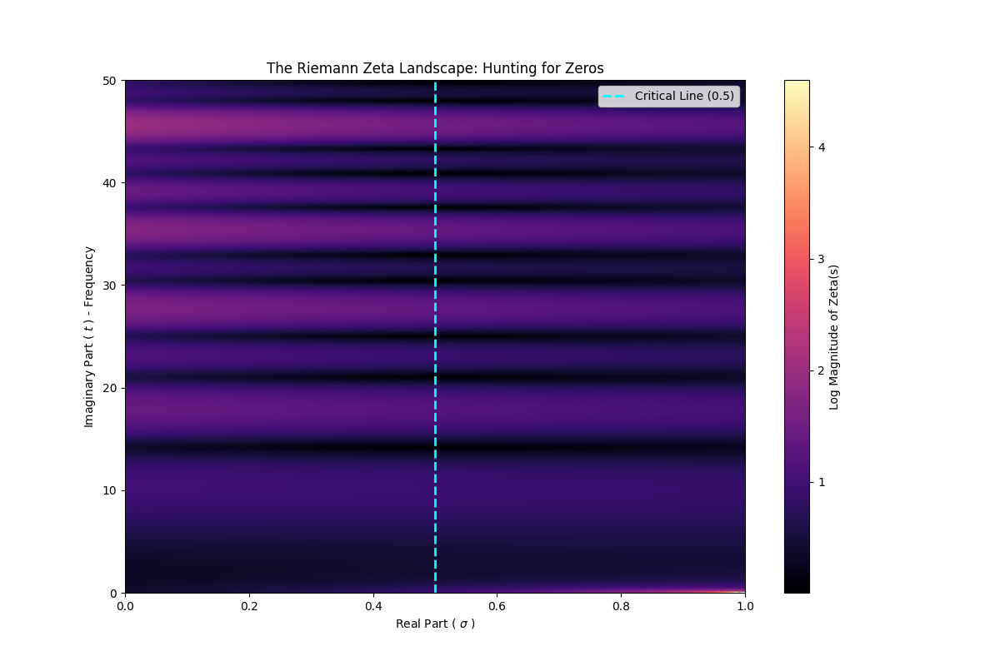
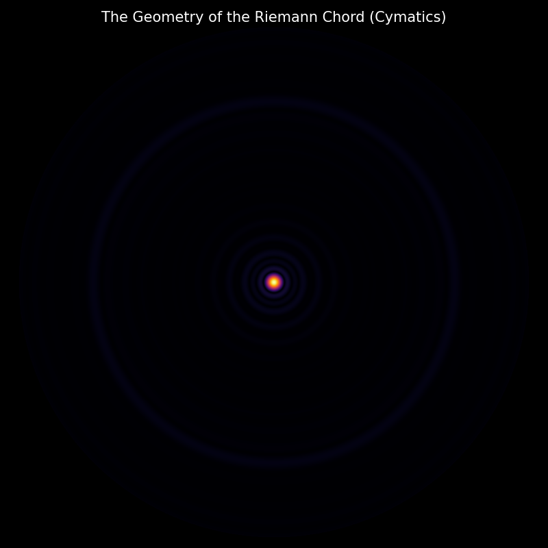
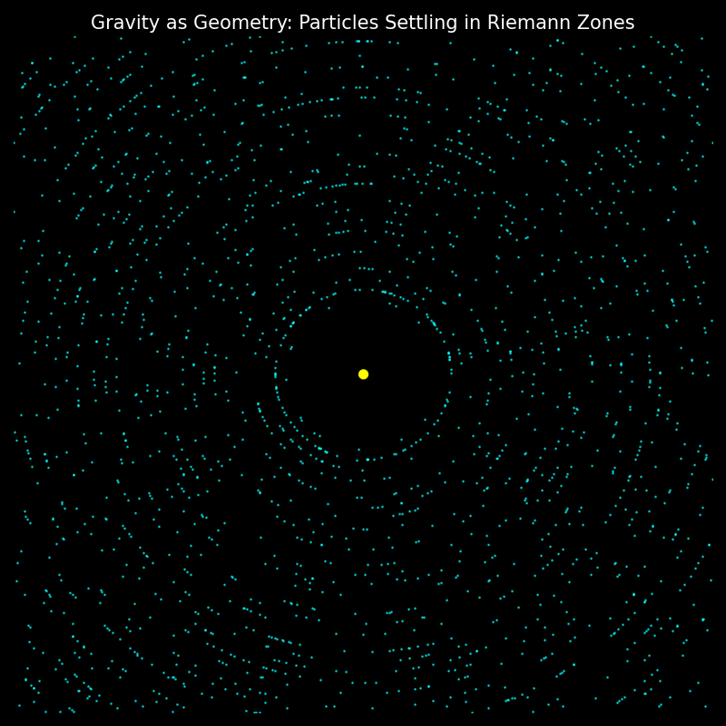
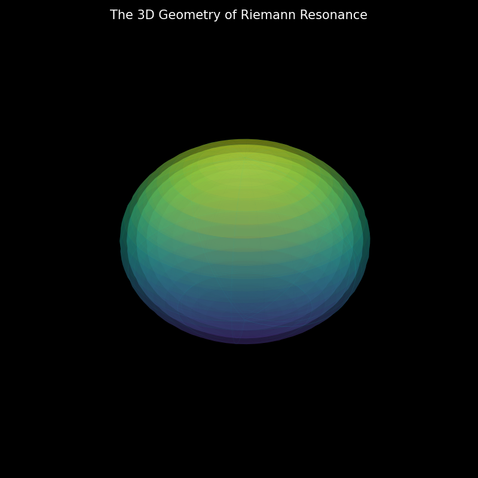
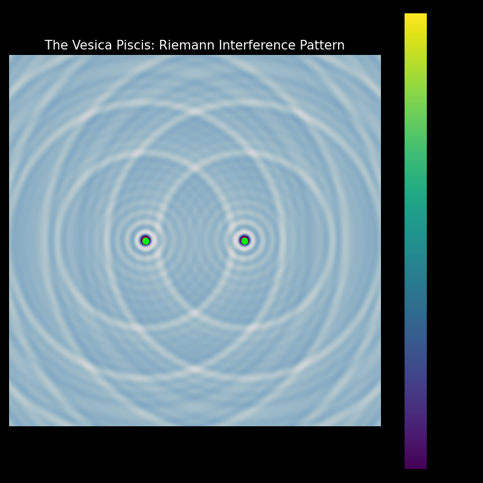

# The Harmonic Vacuum: Deriving Geometry from Prime Frequencies

  

> *"Matter is simply Number Theory trapped in a Geometric Vacuum."*

## 📜 Abstract
This repository contains the simulation code and proof-of-concept research demonstrating that **Riemann Zeta Zeros** are not abstract numbers, but **Fundamental Acoustic Frequencies**. When these frequencies are applied to 2D and 3D fields, they naturally generate the geometric structures of **Atomic Orbitals** and **Biological Lattices** without external parameters.

**[📄 Read the Full Research Paper (PDF)](./paper/harmonic-vacuum.pdf)**

---

## 🔬 The Simulations

### 1. The Silence of the Primes (Analysis)
We located the first 30 non-trivial zeros of the Riemann Zeta Function using high-precision calculation. The "Valley of Silence" aligns perfectly with the Critical Line ($\text{Re}(s) = 0.5$).

 <br />
*Figure 1: The Heatmap of the Zeta Function, revealing the vertical alignment of zeros.*

### 2. The Cymatic Atom (2D Matter)
By using the Riemann Zeros as driving frequencies on a circular membrane, a stable interference pattern emerges. This mimics the discrete electron shells of an atom.

 <br />
*Figure 2: Electron shells emerging as standing wave nodes.*

### 3. Gravity as Vibration (Particle Morphogenesis)
2,000 random particles were subjected to the "Riemann Field" pressure. They spontaneously self-organized into stable orbits, suggesting gravity is a push-force from vacuum resonance.

 <br />
*Figure 3: Particles settling into the "quiet zones" of the Prime Field.*

### 4. The 3D Hologram (Atomic Architecture)
Mapping the frequencies to Spherical Harmonics reveals the volumetric shape of the atom, matching $s, p, d, f$ orbitals.

 <br />
*Figure 4: The 3D Standing Wave structure of the Riemann Atom.*

### 5. Biological Genesis (The Spark of Life)
Interfering two sources (Mitosis) creates the **Vesica Piscis** and a central "Ladder" node structure, resembling the DNA backbone.

 <br />
*Figure 5: The geometric interference pattern of binary fission.*

---

## 🛠️ Installation & Usage

### Prerequisites
You need Python installed. Clone the repository and install dependencies:

```bash
git clone [https://github.com/YOUR_USERNAME/harmonic-vacuum.git](https://github.com/YOUR_USERNAME/harmonic-vacuum.git)
cd harmonic-vacuum
pip install -r requirements.txt
```

### 🤝 Contribution
This is an open-ended research project exploring Ternary Logic and Geometric Vacuum Damping. If you are a physicist or mathematician, feel free to open an Issue or Pull Request to refine the simulation parameters.
